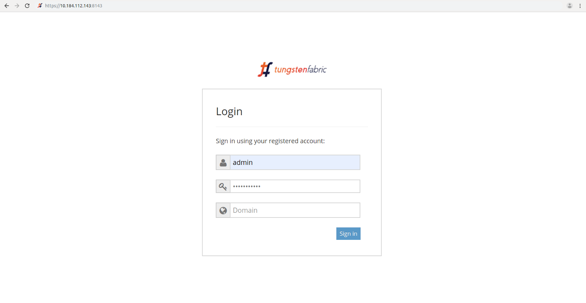
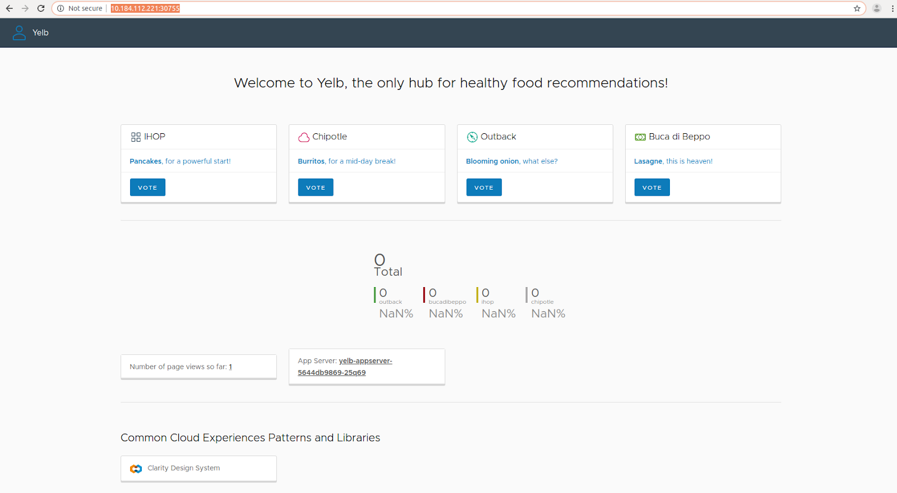
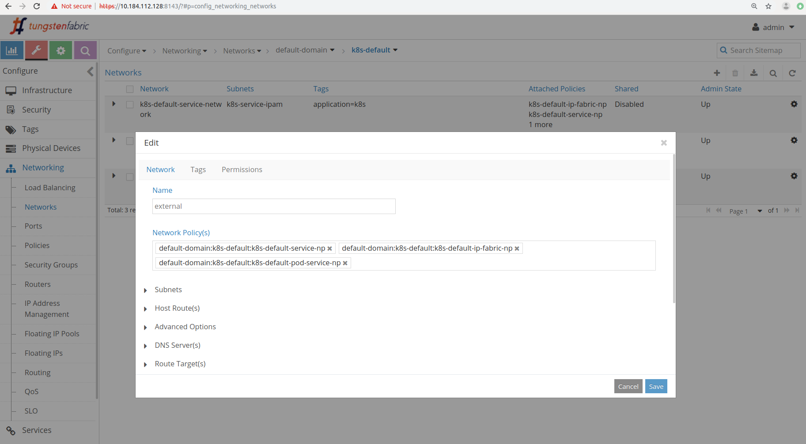
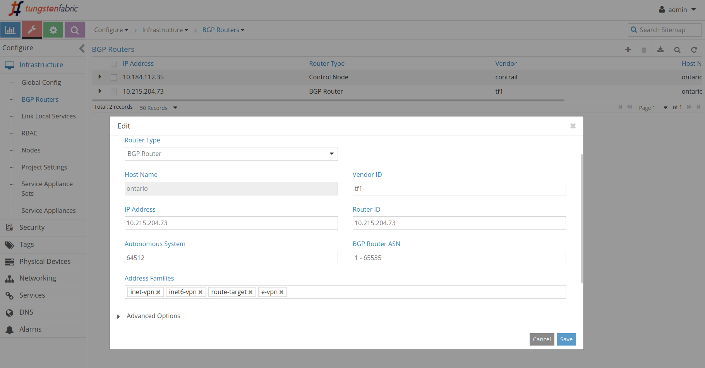

Tungsten Fabric as a CNI for Kubernetes: A Quick Start Guide
=============================================================

Tungsten Fabric (TF), formerly known as OpenContrail, is an open source multi-cloud, multi-stack Software Defined Networking (SDN) solution that provides a single point of control to observe, analyze and securely manage the connectivity between workloads running in the same or different domains. It essentially consists of two main components, namely: the TF controller and TF vRouter. The former collects statistics and maintains the network model and policies, whereas the latter is deployed at each host to enforce those policies. A more detailed description of the TF architecture is presented here.

TF is compatible with a wide range of cloud technology stacks, including the well-known Kubernetes (K8s) container management platform. A key component in K8s is the Container Networking Interface (CNI), i.e., a plugable framework which provides the networking functionality between pods as well as externally facing services. By default K8s provides a flat networking model wherein all pods can talk to each other. Tungsten Fabric adds additional networking functionality to the CNI solution including multi-tenancy, network isolation, micro-segmentation with network policies, load-balancing etc.

This document serves as a quick start guide for beginners looking to deploy TF for managing the K8s cluster networking. We will start by setting up a basic K8s cluster and configure TF to be used as an addon plugin to manage and monitor the connectivity between pods. The rest of the guide will walk you through a number of use cases, starting with a few simple scenarios and then moving onto more advanced ones.

----

Prerequisites
-------------

This guide assumes that the reader has a basic knowledge of `Git`, `Ansible` and some Linux CLI/terminal tool such as `vim`, `nano` and `less`. Kubernetes cluster and TF will be deployed on virtual machines, which we refer to as 'Target nodes'. Throughout this guide Tungsten Fabric solution will be provisioned via `Ansible` automation tool. In order to deploy TF solution, besides the Target nodes mentioned earlier, we also need another node, from which we will run `Ansible` commands. Similarly, this node can be either a virtual machine or your own local machine. We will refer to this node as 'Deploy node'.

----

Hardware and Software Requirements
----------------------------------

Below are specified the minimum hardware and software requirements that need to be met for a smooth Tungsten Fabric experience.

Hardware:

    1. Target Nodes:
        * At least 8 vCPU cores
        * At least 32 GB RAM
        * At least 100 GB storage
       
    2. Deploy Node:
        * At least 2 CPU cores
        * At least 4 GB RAM
        * At least 50 GB storage
             
Software:

    * `CentOS 7.4` or greater
    * `Kernel release 3.10.0.862` or greater
    * `Ansible 2.6.4` or greater
    * `git`

----

Preparation
-----------

1. Generate a public ssh key in your `Deploy Node`:

    * In command prompt of `Deploy Node` run: ssh-keygen.
    * Press <Enter> to accept all default settings.
    * Your ssh keys would be generated and placed in the folder '.ssh' of home directory.
    * To view your public key, run: cat .ssh/id_rsa.pub

2. Copy SSH public key to the authorized key file `.ssh/authorized_keys` of `Target Nodes`. Alternatively, you can run the following command:

    * ``# ssh-copy-id root@<Target_Node_IP_Address>``

3. Install `pip` and `Ansible` in `Deploy Node`:
    * `` yum install -y yum-plugin-priorities yum-utils vim net-tools git ansible``

4. Clone the [TF Ansible deployer repository](https://github.com/Juniper/contrail-ansible-deployer) in `Deploy Node`:
    * `` git clone https://github.com/Juniper/contrail-ansible-deployer.git ``

----

Basic Deployment of Tungsten Fabric as a CNI for K8s
----------------------------------------------------

### Configuration

In this section we will demonstrate a basic deployment of TF. Before proceeding we would need to configure the `instances.yml` located within the `contrail-ansible-deployer/config` folder of the cloned repository. It contains three main sections:

1. `provider_config`: contains provider specific setting such as the ssh user name and location of ssh keys required to login to the target hosts.

2. `instances`: contains target host specific information and specifies which roles to install on each host.

3. `contrail_configuration`: contains TF configuration settings. All parameters in this section are optional. A list of parameters for this section is presented in `contrail_configuration.md` of the cloned repository.

The following shows a sample `instances.yaml` configuration for a k8s cluster with two nodes, one acting as a master and the other as a worker. A separate IP space for `KUBERNETES_SERVICE_SUBNETS` (service) and `KUBERNETES_POD_SUBNETS` (pods) is defined with different CIDRs. Note by default the minimum database disk space requirement is set to 256GB, however, for this deployment we have changed it to 2GB as can be seen in `DATABASE_NODEMGR__DEFAULTS__minimum_diskGB` and `CONFIG_DATABASE_NODEMGR__DEFAULTS__minimum_diskGB:`. Fill in placeholders - marked as ``<...>`` - with info from your setup:

    provider_config:
      bms:
      ssh_user: root
      ssh_public_key: <Path_to_public_key>
      ssh_private_key: <Path_to_private_key>
      domainsuffix: local
    instances:
      bms1:
       provider: bms
       ip: <TF_contrroller_IP_address_master_node>
       roles:
        config_database:
        config:
        control:
        analytics:
        analytics_database:
        webui:
        k8s_master:
        kubemanager:
        k8s_node:
        #vrouter:
      bms2:
       provider: bms
       ip: <Worker_IP_address>
       roles:
        vrouter:
        k8s_node:
    global_configuration:
      CONTAINER_REGISTRY: opencontrailnightly
    contrail_configuration:
      CONTAINER_REGISTRY: opencontrailnightly
      CONTRAIL_VERSION: latest
      KUBERNETES_CLUSTER_PROJECT: {}
      KUBERNETES_IP_FABRIC_SNAT: True
      KUBERNETES_POD_SUBNETS: 10.64.0.0/12
      KUBERNETES_SERVICE_SUBNETS: 10.128.0.0/12
      DATABASE_NODEMGR__DEFAULTS__minimum_diskGB: 2
      CONFIG_DATABASE_NODEMGR__DEFAULTS__minimum_diskGB: 2
      #KUBERNETES_PUBLIC_FIP_POOL: {'domain': 'default-domain', 'project': 'k8s-default', 'network': 'external', 'name': 'default'}

---

### Installation
Switch to the main directory of `contrail-ansible-deployer` and deploy Tungsten Fabric in a simple three step process as below:

    cd contrail-ansible-deployer
    ansible-playbook -e orchestrator=kubernetes -i inventory/ playbooks/configure_instances.yml
    ansible-playbook -e orchestrator=kubernetes -i inventory/ playbooks/install_k8s.yml
    ansible-playbook -e orchestrator=kubernetes -i inventory/ playbooks/install_contrail.yml

Note: the above procedure first installs docker and Kubernetes and then deploys the TF framework.

---

### Validation

After the Tungsten Fabric deployment, we can run ``contrail-status`` command on the master node to check whether Tungsten Fabric Docker containers are up and running. A successful installation should display all Tungsten Fabric containers as `active`. Following is the expected output of `contrail-status`:

    == Contrail control ==
    control: active
    nodemgr: active
    named: active
    dns: active

    == Contrail config-database ==
    nodemgr: active
    zookeeper: active
    rabbitmq: active
    cassandra: active

    == Contrail kubernetes ==
    kube-manager: active

    == Contrail database ==
    nodemgr: active
    query-engine: active
    cassandra: active

    == Contrail analytics ==
    api: active
    nodemgr: active
    collector: active

    == Contrail webui ==
    web: active
    job: active

    == Contrail vrouter ==
    nodemgr: active
    agent: active

    == Contrail device-manager ==

    == Contrail config ==
    svc-monitor: active
    nodemgr: active
    device-manager: active
    api: active
    schema: active

Alternatively, the installation can also be verified by accessing the TF web interface via port `8143` over `HTTPS`:

    https://<TF_contrroller_IP_address_master_node>:8143
    Default credentials: 
        * username: admin
        * password: contrail123

----

Use Cases
---------

So far we have configured and deployed the TF framework on to as a CNI for a Kubernetes cluster. The rest of this guide will walk you through a few common scenarios around networking that you can encounter when developing and operating an application that runs on Kubernetes. For the purpose of demonstration, we will be using a very simple, light-weight and well documented mock application called `yelb`. Further details on its working and internal architecture can be found [here](https://github.com/mreferre/yelb#yelb-architecture). It essentially comprises of four components: `yelb-ui` the frontend UI, `yelb-appserver`, `yelb-db` postgres backend database and `yelb-cache` redis cache server.

    #Switch to Target Node 1 (Master Node) and make sure you have
    #switched to the root user before proceeding further:
    sudo -i
    whoami | grep root || sudo -s

    #Install git:
    yum -y install git

    #Clone the `yelb` repository into Target node’s home directory:
    git clone https://github.com/mreferre/yelb

----

### Case 1: Deploying an application with TF managed networking

The most basic and fundamental functionality provided by any CNI plugin is to enable application pods to communicate with each other, i.e., at minimum provide a pod-to-pod connectivity. In addition to this, the CNI must also manage all incoming and outgoing pods in a smooth and scalable fashion. When you create a Deployment, the CNI plugin works in coordination with Kubernetes to assign IP addresses to each of the application Pods, and interconnect each pod to the cluster’s network

To demonstrate this use case we would deploy the `yelb` app onto our previous TF deployment:

    #Switch to manifests directory within the cloned repository:
    cd yelb/deployments/platformdeployment/Kubernetes/yaml

    #Deploy yelb:
    kubectl create -f cnawebapp-loadbalancer.yaml

Upon successful deployment of `yelb`, the TF should have assigned each pod with a unique IP addresses and they must be listening to their own respective ports. To verify the deployment, in the Target Node:

    #Check that all ports have their own IP address:
    kubectl get pods -o wide

    #Check that all services have a Virtual IP (VIP) and a port
    #they are listening on:
    kubectl get svc

Following is the expected output:

    #kubectl get pods -o wide
    NAME                             READY     STATUS    RESTARTS   AGE       IP              NODE       NOMINATED NODE
    redis-server-77b4d88467-4t88m    1/1       Running   0          17m       10.79.255.248   workr-on   <none>
    yelb-appserver-5644db9869-25q69  1/1       Running   0          17m       10.79.255.249   workr-on   <none>
    yelb-db-7dcf8875c9b-mrbtk        1/1       Running   0          17m       10.79.255.247   workr-on   <none>
    yelb-ui-769bbc6cd4-jwj94         1/1       Running   0          17m       10.79.255.250   workr-on   <none>

    #kubectl get svc
    NAME             TYPE           CLUSTER-IP        EXTERNAL-IP        PORT(S)        AGE
    kubernetes       ClusterIP      10.128.0.1        <none>             443/TCP        99m
    redis-server     ClusterIP      10.134.139.172    <none>             6379/TCP       17m
    yelb-appserver   ClusterIP      10.133.149.100    <none>             4567/TCP       17m
    yelb-db          ClusterIP      10.131.229.152    <none>             5432/TCP       17m
    yelb-ui          LoadBalancer   10.143.63.214     <pending>          80:30755/TCP   17m

Note: Observe the IP and and Cluster-IP in both cases, these are assigned according to the CIDR's defined in `instances.yaml` manifest.

To access the `yelb` UI point your browser to `<Target_Node_IP_Address>:<yelb-ui_Port_Number>`.

Once you’ve explored enough, clean things up to proceed to next case:

    #Delete the `yelb` app:
    kubectl delete -f cnawebapp-loadbalancer.yaml

----

### Case 2: Exposing an external IP to service

Notice the pending External-IP in the output of `kubectl get svc` in previous case, this prevents a direct access to application. In this section we will be configuring Tungsten Fabric to dynamically allocate floating IP to servcies. For demostration we will be using the same setup as in previous case. Login to the TF `web-UI` and move onto the `configure` tab and then switch to `Networking -> Networks`. We will first create a new network in `K8-default project`. Click the `+` icon on the right to start creating a new network. Enter the network name and select all the default policies. 

Next add a new userdefined `Subnet` and in the `Advanced Options` section check the following boxes:

    External
    IP Fabric Forwarding
    Reverse Path Forwarding
    SNAT

Finally, in the master node CLI execute the following steps. Fill in placeholders - marked as `<...>` - with the required information from your setup:

    #Get the container ID of `kube-manager`
    docker container list | grep kube-manager 

    #Access the container
    docker container exec -it <CONTAINER_ID> /bin/bash

    #Open the entrypoint instruction file
    vi entrypoint.sh

    #Under the [VNC] section edit the public_fip_pool line as following then save and exit
    public_fip_pool = {'domain': 'default-domain', 'project': 'k8s-default', 'network': '<YOUR_NETWORK_NAME>', 'name': 'default'}

    #Exit and restart the container
    exit
    docker restart <CONTAINER_ID>

Check the service listing `kubectl get svc` it shoud now show an external-ip for `yelb-ui`

   
    #kubectl get svc
    NAME             TYPE           CLUSTER-IP        EXTERNAL-IP        PORT(S)        AGE
    kubernetes       ClusterIP      10.128.0.1        <none>             443/TCP        118m
    redis-server     ClusterIP      10.134.139.172    <none>             6379/TCP       36m
    yelb-appserver   ClusterIP      10.133.149.100    <none>             4567/TCP       36m
    yelb-db          ClusterIP      10.131.229.152    <none>             5432/TCP       36m
    yelb-ui          LoadBalancer   10.143.63.214     10.32.0.3          80:30755/TCP   36m

Note: The subnet we defined was 10.32.0.0/12

----

### Case 3: Adding a network policy
Kubernetes uses network policies to describe the communication behaviour of application pods deployed on the platform. These policies are mainly user-defined and are not enforced by K8s itself but is instead passed onto the underlying CNI addon plugin. Tungsten Fabric fully supports the network policies irrespective of the deployment scenario, it allows the user to define various rules relating to the traffic, port, and the sequence in which to apply a rule.

For the purpose of demonstration, we would be defining a very simple policy to pass all incoming traffic to `yelb-ui`. The policy will be f

    #Create a new file named `all_pass_policy.yaml`
    vi all_pass_policy.yaml

    #Copy and paste the following content and then save
    apiVersion: v1
    kind: NetworkPolicy
    metadata:
     name: yelb-ui-in
    spec:
     podSelector:
      matchLabels:
       app: yelb-ui
       tier: frontend
     policyTypes:
     - Ingress
     ingress:
     - from:
       - ipBlock:
          cidr: 0.0.0.0/0
       ports:
       - protocol: TCP
         port: 80

The above Policy basically says that for Pods with Labels of `app: yelb-ui` and `tier: frontend`, allow all incoming traffic from any source IP as long as it’s going to the Pod’s TCP port 80.

    #Execute the policy: 
    kubectl apply -f all_pass_policy.yaml

----

### Case 4: Namespace segmentation
Kubernetes uses namespaces to organize multiple virtual clusters within a single physical cluster so as to logical separate multiple environments. This helps reduce the number of clusters and share the spare capacity. While namespaces are useful in keeping things organized in a cluster, however, they are incomplete without the ability of isolating namespaces network-wise. Tungsten Fabric fully supports namespace segmentation, an application deployed into an isolated Namespace cannot reach any Pods outside the Namespace it’s in, and its Pods and Services cannot be reached by applications from other Namespaces. TF helps manage what network communications are allowed for applications in virtual clusters.

Using the same setup from `case 2` lets consider different scenarios for namespace segmentation. First lets create a new manifest that describes our new isolated Namespace:

    #Create a new file named `dev-isolated.yaml` with the following content:
    apiVersion: v1
    kind: Namespace
    metadata:
     name: "dev-isolated"
     annotations: {
       "opencontrail.org/isolation" : "true"
     }

Note the annotations section - this is what signals TF to make your new Namespace isolated. Next let's create this namespace:

    #create our new namespace:
    kubectl create -f dev-isolated.yaml

    #let’s have a look at the new Namespace:
    kubectl describe namespace dev-isolated

To test out the Namespace we have just created, we will deploy a dummy pod in `kube-system` namespace and two different instances of the `yelb` application. One deployed in the `isolated` Namespace that we’ve created and other in `default` Namespace:

    #start a dummy pod in `kube-system`
    kubectl run -i --tty --rm <DUMMY_POD_NAME> --image=nicolaka/netshoot --restart=Never --namespace kube-system -- /bin/bash

    #let the pod run in background
    ctrl + c

    #deploy in isolated namespace:
    kubectl create --namespace dev-isolated -f cnawebapp-loadbalancer.yaml

    #deploy in default namespace:
    kubectl create -f cnawebapp-loadbalancer.yaml

The behaviour that we expect from this segmentation if four-fold. First, the pods and services in non-isolated Namespace should be reachable from other pods in non-isolated Namespaces (such as `default` and `kube-system`). To verify this, we could use one of Pods in `kube-system` namespace to try reach Pods and Services in our app that’s running in the non-isolated namespace `default`:

    # Get the name of one of the kube-system pods; <DUMMY_POD_NAME>:
    src_pod=$(kubectl get pods --namespace kube-system | grep <DUMMY_POD_NAME> | awk '{print $6}')

    # Now let's get an IP of the “yelb-ui” pod in “default” namespace:
    dst_pod_ip=$(kubectl get pods -o wide | grep yelb-ui | awk '{print $1}')

    # Now let's initiate a ping between two pods:
    kubectl exec --namespace kube-system -it ${src_pod} ping ${dst_pod_ip}

The outpur should a conistent pinging between the two pods use `ctl + c` to stop the process.

Second services in non-isolated Namespaces should be reachable from Pods running in isolated Namespaces.

    # Get the Cluster IP of the “yelb-ui” Service running in the “default” Namespace:
    default_yelb_ui_ip=$(kubectl get svc --namespace default -o wide | grep yelb-ui | awk '{print $3'})

    # Get the name of "yelb-appserver" Pod in the “dev-isolated” Namespace:
    src_pod2=$(kubectl get pods --namespace dev-isolated | grep yelb-appserver | awk '{print $1}')

    # Run "curl" on "yelb-appserver" trying to reach the Service IP in “default” Namespace:
    kubectl exec -it -n dev-isolated ${src_pod2} -- /usr/bin/curl http://${default_yelb_ui_ip}

The output should show HTML code of `yelb-ui` page, which shows that a Pod in `dev-isolated` Namespace can talk to a Service in non-isolated `default` Namespace.

Third pods and services in isolated Namespaces should only be reachable from pods within that Namespace. To verify this let’s ping a pod running in the `dev-isolated` Namespace from a pod in `kube-system`

    #get an IP of the "yelb-ui" pod in "dev-isolated" namespace:
    isolated_pod_ip=$(kubectl get pods -n dev-isolated -o wide | grep yelb-ui | awk '{print $6}')

    #pinging it:
    kubectl exec --namespace kube-system -it ${src_pod} ping ${isolated_pod_ip}

From the output you may notice that the command is stuck, not displaying any responses because this time we’re trying to reach something that isn’t reachable because TF is preventing it. Press ctrl+c to cancel.

The final behaviour to verify is an exception to the above one: Services of type `LoadBalancer` in isolated Namespaces will be reachable from the outside world. This can be verified by following the first use case. A copy of `yelb` running in an isolated Namespace `dev-isolated` should be available to the Internet through the `LoadBalancer` Service `yelb-ui`:

    kubectl get svc --namespace dev-isolated -o wide | grep yelb-ui | awk '{print $4}'

point your browser to it and see if our application loads!

Let's clean thing up

    #Delete the two copies of "yelb":
    kubectl delete -f cnawebapp-loadbalancer.yaml
    kubectl delete --namespace dev-isolated -f cnawebapp-loadbalancer.yaml

    #Delete the isolated namespace and its Manifest:
    kubectl delete -f dev-isolated.yaml
    rm -f dev-isolated.yaml

----

### Case 5: BGP peering

Kubernetes clusters are often deployed in multiple clouds/sites with distinct networks and therefore require connectivity so that distributed pods/services can interact with each other. Tungsten Fabric fully supports such deployments and provides an easy to set up BGP peering. To demonstrate this use case we will be using two deployments of TF based K8s cluster with slightly different configurations each deployed in a different network. The changes required are different IP ranges for pods and service in each cluster, this can be done modifying the manifest `instances.yaml` and changing the CIDR's for both `KUBERNETES_POD_SUBNETS` and `KUBERNETES_SERVICE_SUBNETS`.

After the deployment access the TF web UI of each cluster and switch to `configure` tab and then `infrastructure -> BGP router`. Click on `+` to create a BGP router. From router type select `BGP Router` and enter host name and vendor id. Insert the IP address of the other cluster's master node you want to BGP peer with. Scroll down to `Associate Peer(s)` section and add a peer with local.

To verify that the two cluster are connected successfully we would be running two dummy pods (one in each cluster) and try pinging between them. Fill in placeholders - marked as `<...>` - with the required information from your setup:

    #Switch to the master node of each cluster and start a dummy pod with the following command
    kubectl run -i --tty --rm <DUMMY_POD_NAME> --image=nicolaka/netshoot --restart=Never -- /bin/bash

    #Let the pod run in bakground
    ctrl + c

    #Get the IP address for the pods
    kubectl get pods -o wide

    #From each cluster try to ping the pod in another cluster
    kubectl exec --namespace default -it <DUMMY_POD_NAME> ping <POD_IP_IN_ANOTHER_CLUSTER>

If the two enviornments are correctly BGP peered you should see a continous pinging between the two pods.

----

### Case 6: Service chaining (*Work In Progress*)

Service chaining essentially involves the use of network services such as a firewall, load balancer etc. interconnected through the network to support an application. It is formed when a network policy specifies that the traffic between two networks has to flow through one or more network functions. The functions can be physical appliances, virtual machines or container-based. Tungsten Fabric, using the user-defined policies creates underlay tunnels starting from a virtual network (left_VN) spanning through the network services in the chain and ending at the right_VN. The figure below shows an example service chain schema with K8s pod

 

Note: TF uses three modes to cater to different types of traffic from network services, namley Transparent, In-Network and In-Network-NAT service-chain. Transparent is typically used for network services that do not modify the packet. In network (or layer-3) service chain provides a gateway service where packets are routed between the service instance interfaces, packets are routed based on destination IP. Finally, the In-Network-Nat mode is similar to In-Network, however, it replicates right virtual-network's prefixes to left virtual-network, but not vice-versa. Typical usecase of this flavor of service-chain is VNF's left interface has private ip, and the right interface has global ip, in a case such as SNAT for internet access is performed. Since private ip can't be exported to the internet, in this case, left virtual-network's prefix can't be replicated to right virtual-network. The aforementioned service chaining process is a very basic walkthrough and falls under the first mode as firewall does not modifies the packet. 

